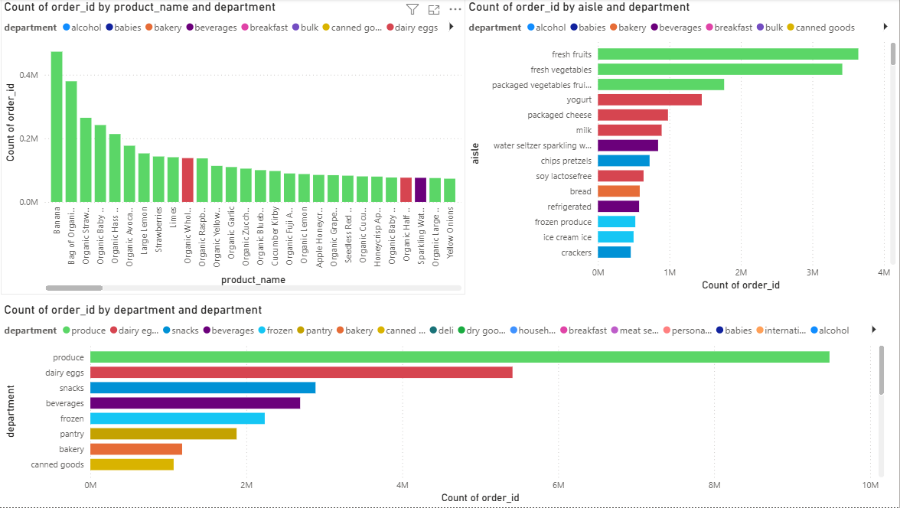
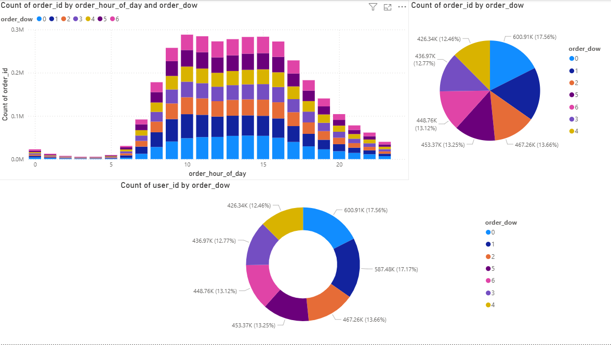
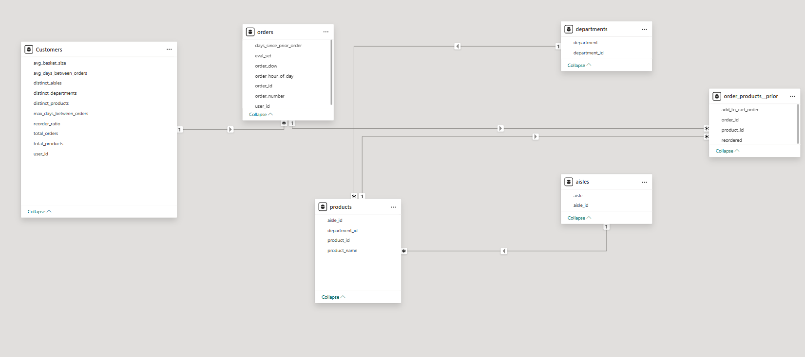

# Retail Analytics & Customer Segmentation

End-to-end retail analytics project using the Instacart dataset. The project builds a Spark-based medallion pipeline from raw transactional files into curated Silver and Gold tables for customer analytics, Power BI reporting, customer segmentation, and LLM/RAG-based natural-language analytics.

## Tech Stack

- Microsoft Fabric / Spark / PySpark
- Bronze, Silver, and Gold medallion architecture
- Python, Pandas
- Power BI
- KMeans clustering
- Azure Machine Learning
- Azure AI Foundry
- LLM/RAG pipeline

## Pipeline

```text
Raw Instacart CSVs
        ↓
Bronze Layer
Raw ingested tables
        ↓
Silver Layer
Cleaned, validated, joined order-line tables
        ↓
Gold Layer
Customer and business-level analytical features
        ↓
Analytics Outputs
EDA, clustering, R analysis, Power BI dashboards
        ↓
Azure ML / Azure AI Foundry
RAG pipeline for natural-language querying over curated outputs
```

## Project Workflow

| Stage                 | File / Tooling                          | Purpose                                                                                            |
| --------------------- | --------------------------------------- | -------------------------------------------------------------------------------------------------- |
| Bronze ingestion      | `01_data_loading.ipynb`                 | Loads raw CSV files, validates initial schemas, and writes Bronze tables                           |
| Silver validation     | `02_data_validation_and_cleaning.ipynb` | Cleans data, fixes type issues, checks nulls, duplicates, ranges, and table relationships          |
| Silver order lines    | `03_silver_order_lines.ipynb`           | Builds transaction-level order-line datasets for feature engineering, and downstream analytics |
| Gold features         | `04_gold_customer_features.ipynb`       | Creates customer and business-level analytical features                                            |
| EDA and visualisation | `05_eda_and_visualization.ipynb`        | Performs behavioural analysis, visualisation, and exploratory summaries                            |
| Power BI reporting    | Power BI                                | Presents curated analytics outputs through dashboard visuals and a semantic model                  |
| Applied AI / RAG      | Azure ML / Azure AI Foundry             | Enables natural-language querying over project context and curated analytics outputs               |

## Power BI Reporting Layer

Power BI is used to present the curated analytics outputs through business-facing dashboards. The report focuses on product demand, aisle and department performance, order timing behaviour, and the semantic model used to connect the reporting tables.

### Dashboard 1: Product, Aisle, and Department Analysis

This dashboard summarises which products, aisles, and departments dominate order volume. It supports retail questions such as which categories drive demand and which product groups appear most frequently in customer baskets.



### Dashboard 2: Order Timing Analysis

This dashboard analyses ordering behaviour across hours of the day and days of the week. It helps identify when customers are most active and how order volume changes across the weekly cycle.



### Power BI Semantic Model

The semantic model connects curated reporting tables so product hierarchy, order behaviour, and customer-level features can be analysed together. This makes the dashboard more than a set of isolated visuals: it provides a structured BI layer over the Silver and Gold outputs.



## RAG Workflow

The implemented RAG layer uses project-specific context from:

- Gold-layer feature descriptions
- Power BI dashboard summaries
- customer segmentation outputs
- medallion architecture documentation
- analytical notes from the notebooks

The retrieval step finds the most relevant context for a user query. The LLM then generates a response using that retrieved context.

This makes the project more than a static BI dashboard: it becomes an interactive analytics assistant for exploring the retail data pipeline and its outputs.

## Current Status

Completed:

- Bronze ingestion
- Silver validation and order-line modelling
- Gold feature engineering
- EDA and visualisation
- customer segmentation
- Power BI dashboard basic
- Power BI semantic model basic
- Azure ML experimentation layer
- Azure AI Foundry LLM/RAG layer